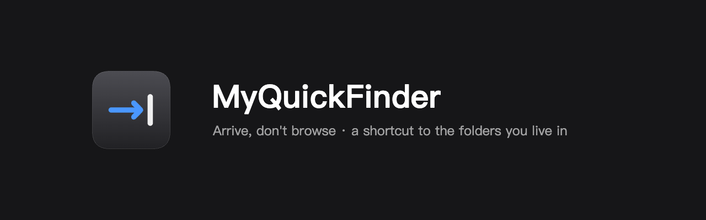

<p align="center">
  
</p>

# MyQuickFinder

[English](README.md) · [中文](README.zh-Hans.md)

A macOS menu bar utility for jumping to a directory fast. A global hotkey opens
the panel; from a favorite or from `~` you walk to the directory you want and
reveal it in Finder, open it in Terminal, or copy its path.

Keyboard first — an interaction is over in two or three seconds. macOS 14+,
unsandboxed, English and Simplified Chinese.

## Install

Grab the notarized `.zip` from
[Releases](https://github.com/alex-coding-studio/MyQuickFinder/releases), unzip
it, and drag `MyQuickFinder.app` into `/Applications`.

The app is unsandboxed but macOS still gates protected directories through TCC.
The first time you browse into one, macOS asks; the panel tells you when a
directory was denied rather than showing it as empty.

## Build from source

Requires Xcode 16+ (Swift 6) and [XcodeGen](https://github.com/yonaskolb/XcodeGen).
The Xcode project is generated from `project.yml` and is not checked in, so
generate it first:

```bash
xcodegen generate
```

```bash
./scripts/lint.sh
```

```bash
swift test --package-path MyQuickFinderKit
```

```bash
xcodebuild -project MyQuickFinder.xcodeproj -scheme MyQuickFinder \
  -destination 'platform=macOS' build
```

`./scripts/lint.sh` needs `swiftformat` and `swiftlint` on `PATH`
(`brew install swiftformat swiftlint`). Everything else the toolchain uses —
formatter and linter configuration, Git hooks, the checks under `scripts/` — is
part of this repository; nothing points outside it.

### Signing

Nothing in `project.yml` pins a signing identity, so a plain build signs
ad-hoc (`CODE_SIGN_IDENTITY = -`) and needs no Apple developer account. That is
the right default for building and running the tests, with one catch worth
knowing: an ad-hoc signature is a hash of the binary, so it changes on every
build. macOS treats each build as a different program, which resets the file
access it had already granted and unregisters the login item.

To keep those across builds, pass your own identity:

```bash
xcodebuild -project MyQuickFinder.xcodeproj -scheme MyQuickFinder \
  -destination 'platform=macOS' \
  CODE_SIGN_IDENTITY="Apple Development: Your Name (XXXXXXXXXX)" \
  DEVELOPMENT_TEAM=YOURTEAMID \
  build
```

To force ad-hoc explicitly — which is what CI does — pass
`CODE_SIGN_IDENTITY="-" DEVELOPMENT_TEAM=""`.

## Release

`./scripts/release.sh` (English) and `./scripts/release-cn.sh` (Chinese) are two
translations of one interactive wizard. It walks you through installing a
Developer ID certificate and storing notarization credentials, verifying each
step as it goes, then signs, notarizes, staples, packages, and publishes.
Certificate and credentials are a one-time setup; later runs skip those steps.

`./scripts/release-auto.sh` runs the same pipeline with no prompts:

```
preflight (main, clean tree, tag free, tests and lint)
  → Developer ID build (Release, build number = commit count)
  → notarize (notarytool submit --wait)
  → staple + verify (stapler, spctl -t install)
  → repackage (zip carries the ticket)
  → tag + push + gh release create
```

It exits at the first step that cannot proceed and says why. The artifact lands
in `.release-artifacts/MyQuickFinder-<version>.zip` and the full log in
`.release-build/release-auto.log`.

**One-time setup:**

1. Install a Developer ID Application certificate into your keychain
   (Xcode → Settings → Accounts → Manage Certificates → `+` → Developer ID
   Application).
2. Store notarization credentials as a keychain profile. With an App Store
   Connect API key:
   ```bash
   xcrun notarytool store-credentials "MyQuickFinder" \
     --key ~/.appstoreconnect/AuthKey_<KEY_ID>.p8 \
     --key-id <KEY_ID> --issuer <ISSUER_UUID> \
     --keychain ~/Library/Keychains/login.keychain-db
   ```
   `ISSUER_UUID` is in App Store Connect → Users and Access → Integrations →
   API Keys. Note: **do not pass `--team-id` with an API key** — notarytool
   reads it as mixing credential types and fails.

   An Apple ID with an app-specific password works too:
   ```bash
   xcrun notarytool store-credentials "MyQuickFinder" \
     --apple-id <your-apple-id> --team-id <YOURTEAMID>
   ```

**Cutting a release:**

```bash
# 1. Bump MARKETING_VERSION in project.yml — an existing tag aborts the release
# 2. Run it (profile name and team id are overridable)
NOTARY_PROFILE=MyQuickFinder ./scripts/release-auto.sh
```

`TEAM_ID` is derived from the Developer ID certificate name unless you export it.

## Continuous integration

`.github/workflows/ci.yml` runs lint, the package tests, and the scheme tests on
every push and pull request. `.github/workflows/release.yml` builds, signs,
notarizes, and publishes a GitHub release when a `v*` tag is pushed, using
repository secrets for the certificate and notarization credentials.

## License

[MIT](LICENSE) © 2026 Cunqi Xiao
